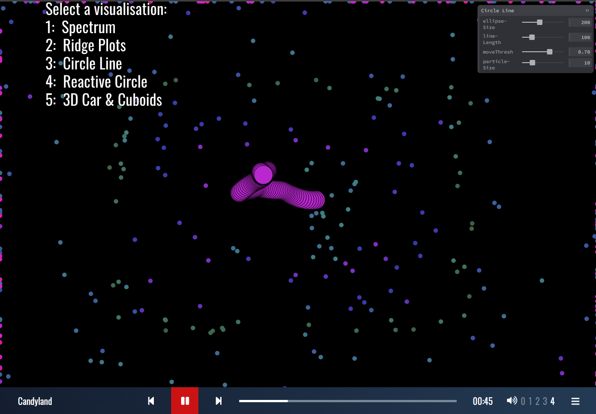

# Music Visualizer App!

“Music Visualizer” Project includes total 5 visualizations (extensions).
[music-vis.vercel.app/](https://music-vis.vercel.app/)

All the visualizations have function to visualize the playing audio/music. I have used Object Oriented Programing for whole projects so, the coding style of the all the visualizers are very similar. Each extension is a constructor function which includes it’s name, tweakpane parameters, function for adding and removing tweakpane GUI, setup function, draw function and some other functions to make the code easier to understand and write for the visualizer.

Following are the 5 visualizers:

**Spectrum:** This visualizer has rectangular vertical bars which are responsive to FFT values and when the values are low or high the color changes dynamically according to the value.

**Ridge Plots:** This visualizer contains waveform lines at top and filled semicircle at bottom. Waveform lines produce waves of lines using FFT waveforms and bottom semicircle is reactive to P5 amplitude.

**Circle Line:** This visualizer contains line of circle and small particles. Circle line moves when amplitude crosses the threshold value and small circles get generated at the edges of the window and disappear as they touch the circle line.

**Reactive Circle:** This visualizer has total 5 parts which are Reactive circle, 8 waveform shapes, particles, dark rectangle overlay and background image. All parts are reactive to the audio. Particles get generated from the edge of the circle, circle and waveforms changes the size/shape as per bass and the background image shows slight rotation when it crosses threshold bass value.

**3D Car & Cuboids:** This visualizer is a 3D version, which is different from previous visualizers. It includes a car and two rows of cuboids. Car runs with a constant speed and the cuboids changes its height and color as per the amplitude of the audio.

